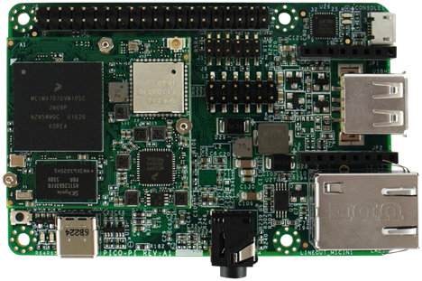
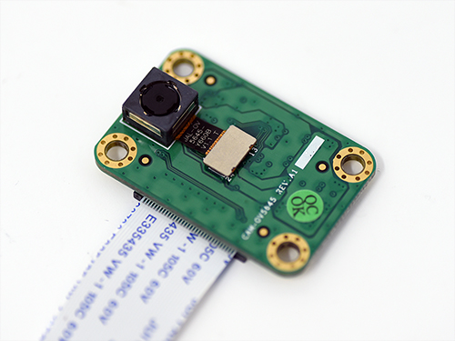
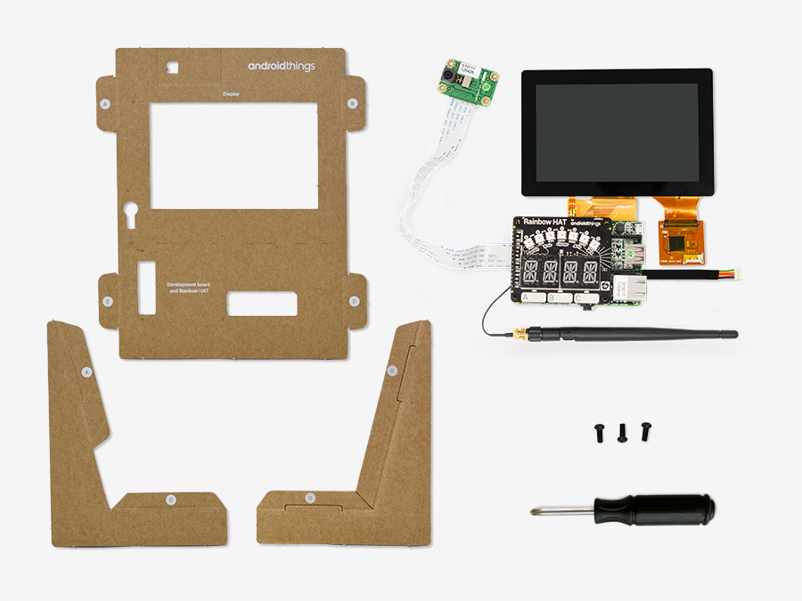

# HardwareClassifier
A hardware system to classify objects. NXP i.MX7D interfaced with camera and touch screen.
<h3>NXP i.MX7D</h3>

The i.MX 7Dual delivers high-performance processing for low-power requirements with a high degree of functional integration. The i.MX 7Dual features an advanced implementation of two ARM®Cortex®-A7 cores, which operate at speeds of up to 1.2 GHz, as well as the ARM® Cortex®-M4 core. The Pico variant is pin-compatible with the Intel® Edison for sensors and low-speed I/O, but also adds additional expansion possibilities for multimedia and connectivity, giving you cutting edge technology that can easily be expanded and implemented for IoT designs.
<h3>Camera</h3>

<h3>Touch Screen</h3>

<h3>Final Inventory Connections</h3>

